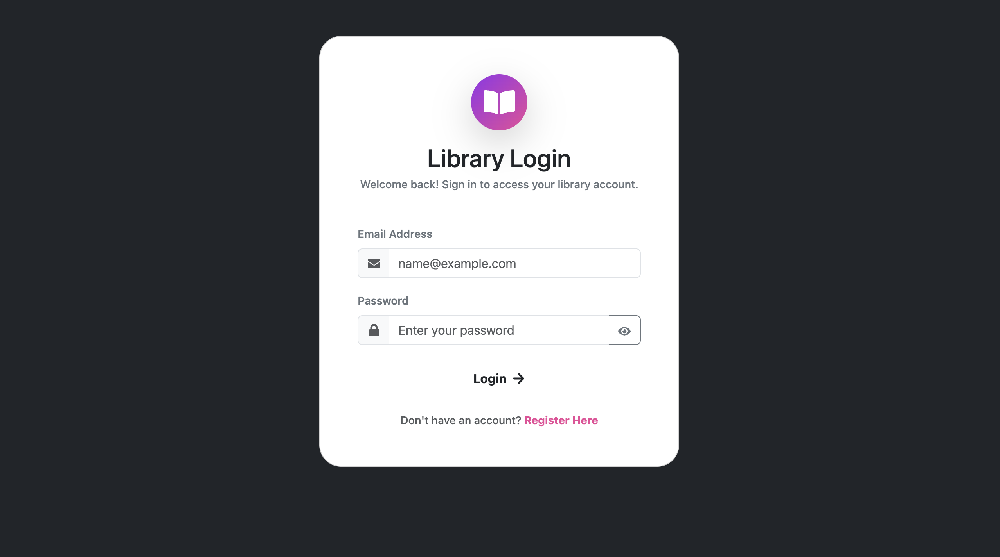
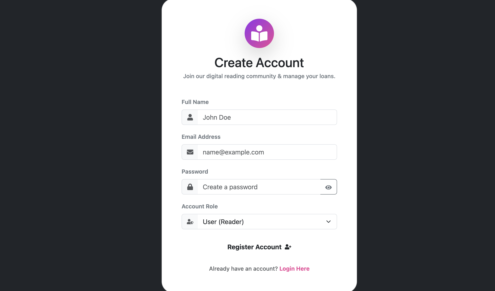
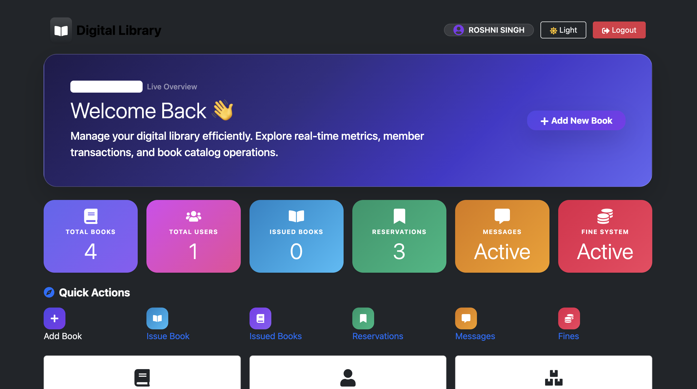
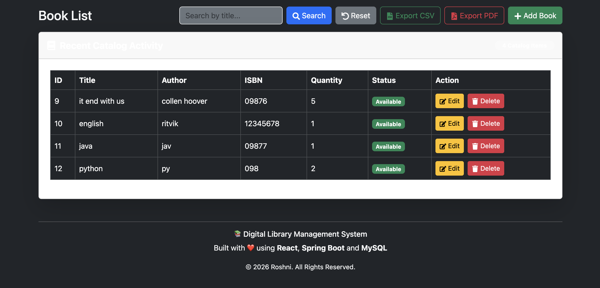
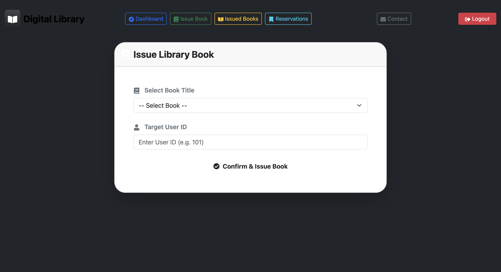
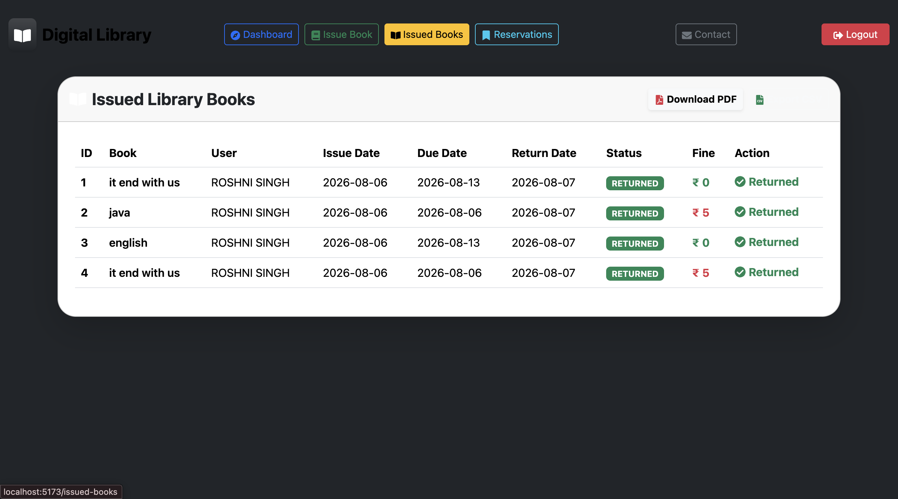
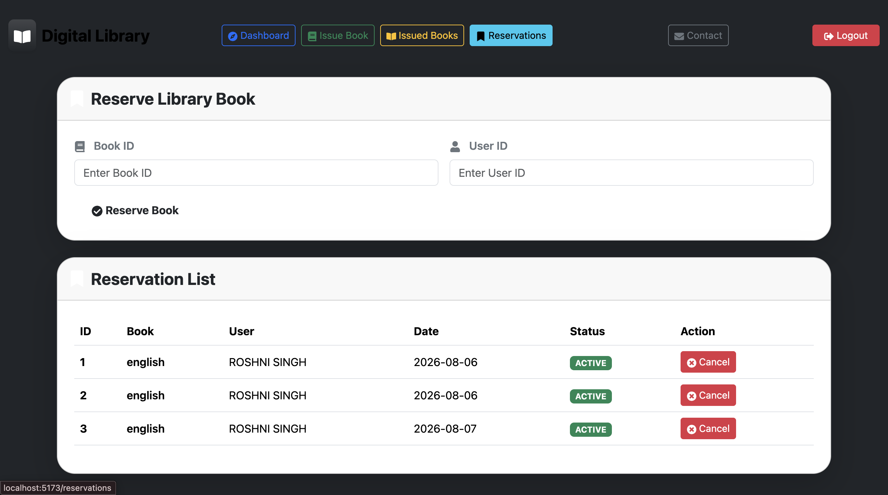
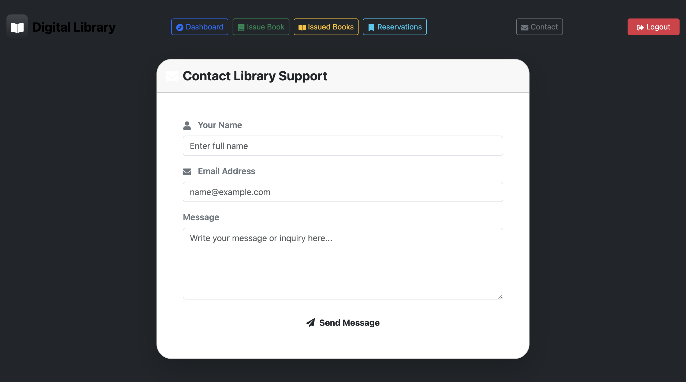
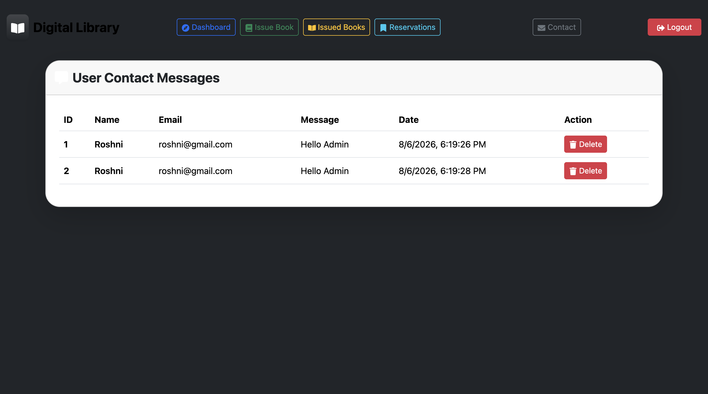
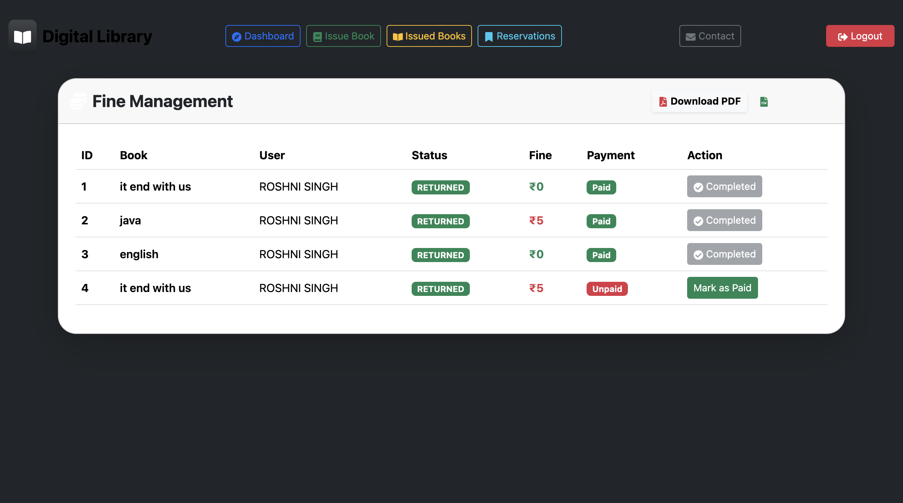

# 📚 Digital Library Management System

<div align="center">


# 📖 Digital Library Management System

### Oasis Infobyte Internship Project

A full-stack Digital Library Management System developed using **Spring Boot**, **React**, **MySQL**, and **Bootstrap**. The application enables efficient management of books, users, issue/return operations, reservations, contact messages, and overdue fines through a modern web interface.

</div>

---

# ✨ Features

## 🔐 Authentication

- User Registration
- User Login
- Protected Routes
- Session Management

---

## 📚 Book Management

- Add New Book
- Update Book Details
- Delete Books
- Search Books
- View All Books
- Quantity Management

---

## 📖 Issue & Return

- Issue Books
- Return Books
- Automatic Stock Update
- Out-of-Stock Validation
- Issue History

---

## 📌 Reservation System

- Reserve Books
- Manage Reservations

---

## 💰 Fine Management

- Automatic Fine Calculation
- ₹5 Per Day Late Fine
- Fine Status
- Payment Tracking

---

## 📩 Contact Module

- Contact Form
- Store Messages
- View Messages
- Delete Messages

---

## 📊 Dashboard

- Library Statistics
- Quick Actions
- Modern Admin Dashboard
- Navigation Panel

---

# 🛠 Tech Stack

### Frontend

- React
- Vite
- Bootstrap 5
- Axios
- React Router
- React Toastify

### Backend

- Java 25
- Spring Boot
- Spring Data JPA
- Hibernate
- REST APIs

### Database

- MySQL

### Development Tools

- IntelliJ IDEA
- VS Code
- Maven
- Git
- GitHub

---

# 📂 Project Structure

```text
Java-Task5-DigitalLibrary
│
├── digital-library-backend
│   ├── src
│   ├── pom.xml
│   └── mvnw
│
├── digital-library-frontend
│   ├── src
│   ├── public
│   ├── package.json
│   └── vite.config.js
│
├── screenshots
│
└── README.md
```

---

# 📸 Application Screenshots

## 🔐 Login



---

## 📝 Register



---

## 📊 Dashboard



---

## 📚 Books



---

## 📖 Issue Book



---

## 📕 Issued Books



---

## 📌 Reservation



---

## 📩 Contact




---

## 💬 Messages



---

## 💰 Fine Management



---

# 🚀 Installation

## Clone Repository

```bash
git clone https://github.com/roshni92027-create/OIBSIP.git
```

---

## Backend

```bash
cd digital-library-backend
```

Configure `application.properties`

```properties
spring.datasource.url=jdbc:mysql://localhost:3306/library_db
spring.datasource.username=root
spring.datasource.password=your_password
```

Run:

```bash
./mvnw spring-boot:run
```

---

## Frontend

```bash
cd digital-library-frontend
npm install
npm run dev
```

Application:

```
http://localhost:5173
```

---

# 🌟 Future Enhancements

- JWT Authentication
- Email Notifications
- User Roles
- Book Cover Upload
- Reports & Analytics
- Charts
- Mobile Responsive Enhancements
- Dark/Light Theme Toggle

---

# 👩‍💻 Author

**Roshni Singh**

GitHub:
https://github.com/roshni92027-create

---

# 📜 License

Developed as part of the **Oasis Infobyte Internship Program** for learning and educational purposes.

---

<div align="center">

⭐ If you found this project useful, consider giving it a star!

</div>