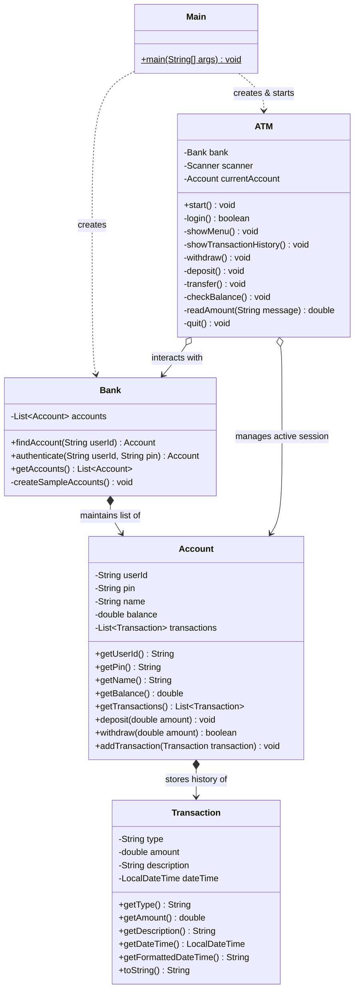
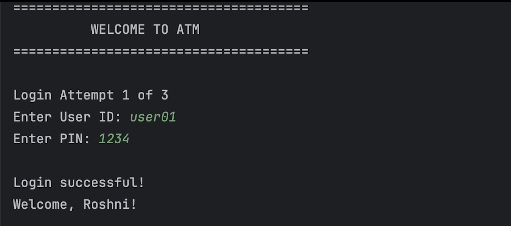
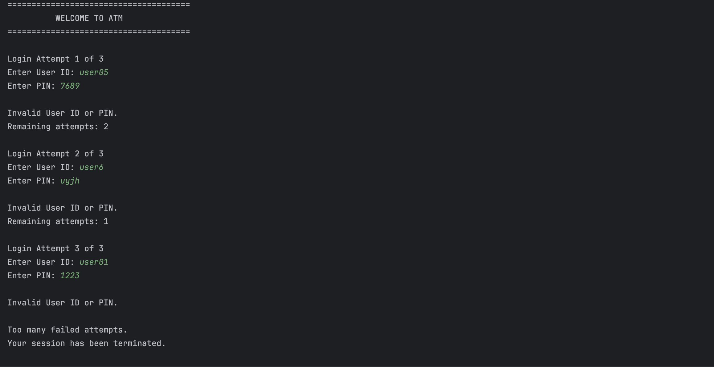
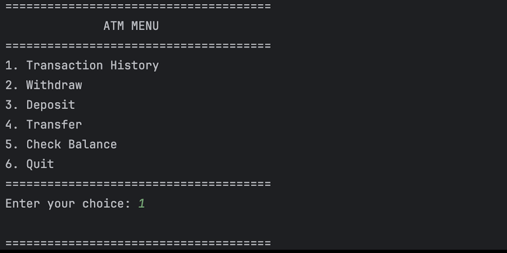
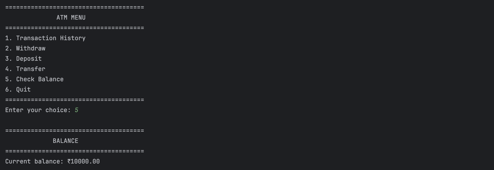
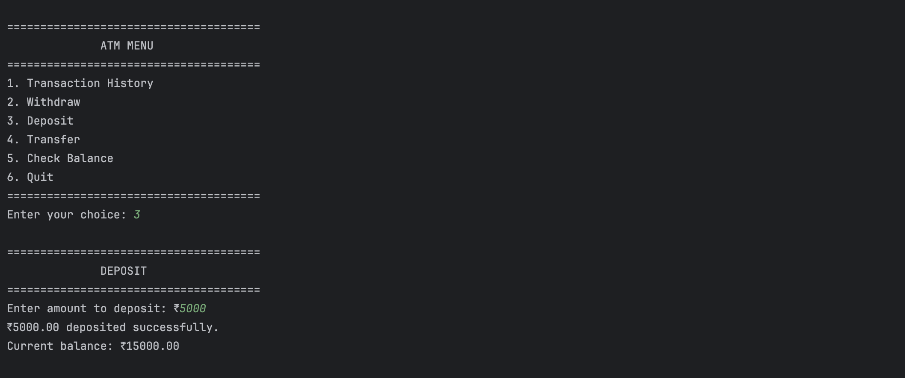
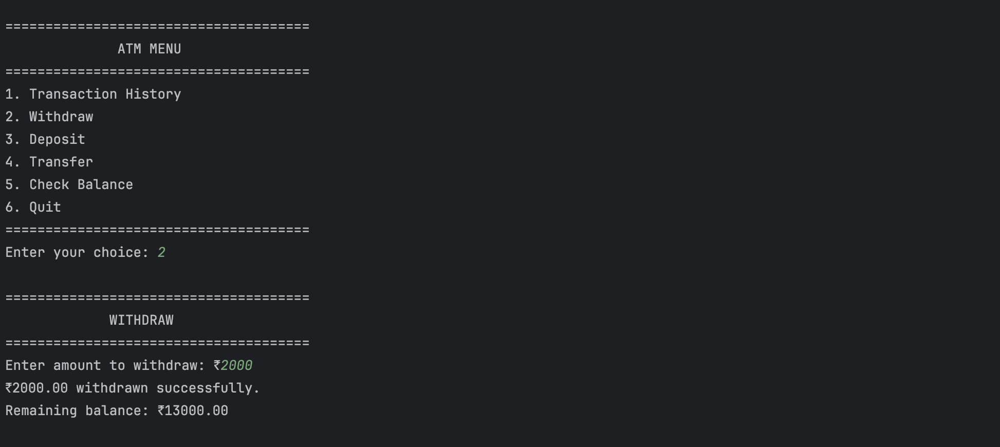
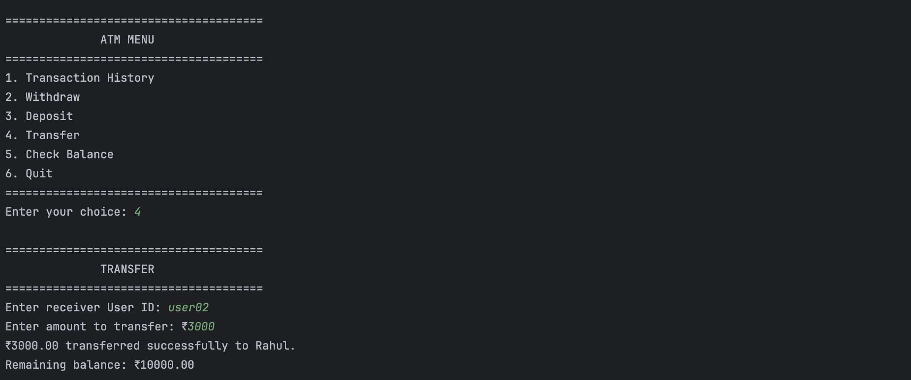
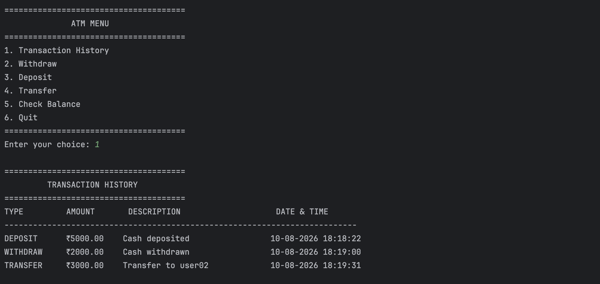
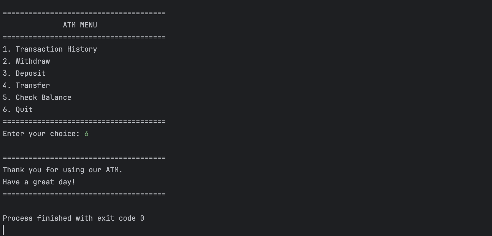

# 🏧 ATM Interface — Java Console Banking System

<p align="center">
  
  
  
  
  
</p>

<p align="center">
  A robust, modular, and secure console-based <strong>Automated Teller Machine (ATM) Simulation System</strong> developed in <strong>Java</strong> as part of the <strong>Oasis Infobyte Internship Program (OIBSIP)</strong>.
</p>

---

## 📑 Table of Contents

- [📌 Project Overview](#-project-overview)
- [🎯 Objectives](#-objectives)
- [✨ Key Features](#-key-features)
- [🏗️ System Architecture & Class Design](#️-system-architecture--class-design)
  - [Class Hierarchy & Responsibilities](#class-hierarchy--responsibilities)
  - [UML Class Diagram](#uml-class-diagram)
- [🔑 Pre-Configured Test Accounts](#-pre-configured-test-accounts)
- [📸 Application Screenshots](#-application-screenshots)
- [📂 Project Directory Structure](#-project-directory-structure)
- [⚙️ Prerequisites & Setup Guide](#️-prerequisites--setup-guide)
  - [Compiling and Running via Terminal](#1-compiling-and-running-via-terminal)
  - [Running in an IDE](#2-running-in-an-ide-intellij-idea--eclipse--vs-code)
- [🧠 OOP Concepts & Design Highlights](#-oop-concepts--design-highlights)
- [📚 Other Internship Projects](#-other-internship-projects)
- [🔮 Future Enhancements](#-future-enhancements)
- [👩‍💻 Author & Acknowledgements](#-author--acknowledgements)

---

## 📌 Project Overview

The **ATM Interface** project simulates an enterprise ATM banking environment where users can authenticate securely using a User ID and PIN and perform essential banking operations through an intuitive console menu.

Built using core **Object-Oriented Programming (OOP)** principles, the application separates responsibilities across dedicated classes for business logic, data models, repository storage, and user interactions. Every financial action updates account balances in real time and automatically creates formatted, timestamped transaction audit logs.

---

## 🎯 Objectives

- **Simulate Real-World Banking:** Provide an end-to-end ATM experience including authentication, cash deposits, withdrawals, fund transfers, and mini statements.
- **Implement Clean OOP Architecture:** Demonstrate encapsulation, modularity, and separation of concerns across dedicated classes.
- **Robust Exception & Input Handling:** Defend against invalid inputs (e.g. non-numeric strings, negative amounts, overdrawing, self-transfers).
- **Audit Trail & Timestamps:** Maintain an in-memory chronological ledger using Java's modern `java.time` Date & Time API.

---

## ✨ Key Features

| Feature | Description |
| :--- | :--- |
| 🔐 **Secure Authentication** | User ID and PIN verification with a **3-attempt maximum** security policy before session lockout. |
| 💰 **Balance Inquiry** | Instant display of real-time account balances formatted with currency precision (`₹0.00`). |
| 📥 **Cash Deposit** | Real-time balance crediting with input verification and automatic ledger entry creation. |
| 📤 **Cash Withdrawal** | Balance debit processing protected by real-time overdraft/insufficient funds checks. |
| 🔄 **Account-to-Account Transfer** | Peer-to-peer fund transfers featuring recipient validation, self-transfer prevention, and dual-party transaction logging. |
| 📜 **Transaction History Ledger** | Formatted mini-statement table showing transaction type, amount, description, and exact timestamp (`dd-MM-yyyy HH:mm:ss`). |
| 🛡️ **Defensive Error Handling** | Gracefully handles non-numeric inputs (`NumberFormatException`), negative/zero values, and invalid menu choices without crashing. |

---

## 🏗️ System Architecture & Class Design

### Class Hierarchy & Responsibilities

The codebase follows a modular design pattern with 5 specialized classes:

1. **`Main.java` (Entry Point):** Bootstraps the application, instantiates the in-memory `Bank` repository, and launches the `ATM` engine.
2. **`ATM.java` (Controller / Presentation Layer):** Manages user interactions, I/O streams, menu loops, input parsing, error messaging, and business workflow orchestration.
3. **`Bank.java` (Data Repository Layer):** Manages the collection of bank accounts, pre-seeds sample customer profiles, and handles credential authentication and account lookup.
4. **`Account.java` (Domain Model / Business Entity):** Encapsulates customer attributes (`userId`, `pin`, `name`, `balance`), maintains account-level transaction lists, and enforces deposit/withdrawal mutations.
5. **`Transaction.java` (Audit Log Entity):** Immutable record capturing transaction details (`type`, `amount`, `description`, `dateTime`) with formatted date-time string output.

### UML Class Diagram



---

## 🔑 Pre-Configured Test Accounts

The `Bank` class comes pre-seeded with sample customer accounts for demonstration and testing:

| User ID | PIN | Account Holder | Initial Balance | Permitted Actions |
| :--- | :---: | :--- | :---: | :--- |
| `user01` | `1234` | **Roshni** | ₹10,000.00 | Full Access (Withdraw, Deposit, Transfer, Inquiry) |
| `user02` | `5678` | **Rahul** | ₹15,000.00 | Full Access (Recipient for peer transfer testing) |
| `user03` | `2468` | **Priya** | ₹20,000.00 | Full Access (Recipient for peer transfer testing) |

---

# 📸 Application Screenshots

## 🔐 1. User Authentication (Login)


---

## ⚠️ 2. Security Lockout (3 Failed Login Attempts)


---

## 🖥️ 3. Main ATM Menu Dashboard


---

## 💰 4. Balance Inquiry


---

## 📥 5. Cash Deposit


---

## 📤 6. Cash Withdrawal


---

## 🔄 7. Account-to-Account Money Transfer


---

## 📜 8. Transaction History Ledger


---

## 🚪 9. Quit & Session Termination


---

## 📂 Project Directory Structure

```text
OIBSIP/
├── ATM-Interface/              # Task 3: ATM Interface
│   ├── .gitignore              # Git ignore configuration
│   ├── README.md               # Detailed ATM Interface documentation
│   ├── screenshots/            # Application screenshots
│   │   ├── check-balance.png
│   │   ├── deposit.png
│   │   ├── Invalid-login.png
│   │   ├── login.png
│   │   ├── menu.png
│   │   ├── Quit.png
│   │   ├── transaction-history.png
│   │   ├── transfer.png
│   │   └── withdrawal.png
│   └── src/
│       └── com/
│           └── roshni/
│               └── atm/
│                   ├── ATM.java          # ATM console interface & controller
│                   ├── Account.java      # Customer account entity & business rules
│                   ├── Bank.java         # In-memory bank repository & authentication
│                   ├── Main.java         # Application entry point
│                   └── Transaction.java  # Transaction audit entity with timestamps
├── Java-Task5-DigitalLibrary/  # Task 5: Digital Library Management System
│   ├── README.md
│   ├── screenshots/
│   ├── digital-library-backend/
│   └── digital-library-frontend/
└── README.md                   # Root documentation
```

---

## ⚙️ Prerequisites & Setup Guide

### System Requirements
- **Java Development Kit (JDK):** Version 8 or higher (Tested on JDK 17 / JDK 21 / JDK 25)
- **Operating System:** Windows / macOS / Linux
- **Terminal / IDE:** Command Prompt, Terminal, IntelliJ IDEA, Eclipse, or VS Code

---

### 1. Compiling and Running via Terminal

1. **Navigate to the `ATM-Interface` folder:**
   ```bash
   cd "ATM-Interface"
   ```

2. **Compile the Java source files into an `out` directory:**
   ```bash
   javac -d out src/com/roshni/atm/*.java
   ```

3. **Run the application:**
   ```bash
   java -cp out com.roshni.atm.Main
   ```

---

### 2. Running in an IDE (IntelliJ IDEA / Eclipse / VS Code)

- **IntelliJ IDEA:**
  1. Open IntelliJ IDEA and select **Open** &rarr; Select the `ATM-Interface` directory (or root `OIBSIP`).
  2. Ensure the Project SDK is configured under **File** &rarr; **Project Structure** &rarr; **Project SDK** (JDK 8+).
  3. Navigate to `src/com/roshni/atm/Main.java`.
  4. Right-click and select **Run 'Main.main()'** (or press `Shift + F10`).

- **VS Code:**
  1. Open the folder in VS Code.
  2. Install the **Extension Pack for Java**.
  3. Open `Main.java` and click the **Run** button above `public static void main`.

---

## 🧠 OOP Concepts & Design Highlights

- **Encapsulation:** All sensitive account attributes (`userId`, `pin`, `balance`, `transactions`) are strictly `private`, accessible only via controlled public getters and business methods.
- **Single Responsibility Principle (SRP):** Each class owns a single responsibility:
  - `ATM` handles user I/O and flow control.
  - `Bank` manages account storage and authentication.
  - `Account` enforces transaction rules (e.g. balance checks).
  - `Transaction` handles audit formatting.
- **Composition & Association:** `Bank` manages a collection of `Account` objects, and each `Account` owns a historical list of `Transaction` records.
- **Defensive Programming:** Implements input sanitation and handles exceptions (`NumberFormatException`) to prevent unexpected crashes during invalid input entry.
- **Modern Date-Time API:** Utilizes `java.time.LocalDateTime` and `java.time.format.DateTimeFormatter` for thread-safe, human-readable transaction timestamps (`dd-MM-yyyy HH:mm:ss`).

---

## 📚 Other Internship Projects

| Project | Stack | Description |
| :--- | :--- | :--- |
| [**Digital Library Management System**](./Java-Task5-DigitalLibrary/) | `Spring Boot 3` • `React 19` • `MySQL` • `Bootstrap 5` | Full-stack library management system with book circulation, member registration, reservations, and fine management. |

---

## 🔮 Future Enhancements

- [ ] **Persistent Database Storage:** Integrate MySQL / PostgreSQL via JDBC or Hibernate for durable data persistence.
- [ ] **Graphical User Interface (GUI):** Build a modern desktop UI using JavaFX or Swing.
- [ ] **Security Upgrades:** Implement BCrypt PIN hashing and One-Time Password (OTP) two-factor authentication.
- [ ] **Multi-Currency Support:** Add dynamic currency conversion for international transactions.
- [ ] **PIN Management:** Enable users to change and reset their security PIN directly from the ATM menu.

---

## 👩‍💻 Author & Acknowledgements

- **Developer:** Roshni Singh ([@roshni92027-create](https://github.com/roshni92027-create))
- **Internship Program:** [Oasis Infobyte](https://oasisinfobyte.com/) — **OIBSIP (Oasis Infobyte Summer Internship Program)**
- **Domain:** Java Development

<p align="center">
  <i>Developed with ❤️ as part of the Oasis Infobyte Java Development Internship.</i>
</p>
